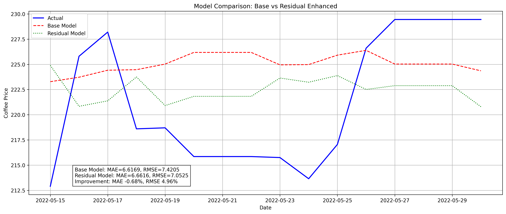

# 잔차 기반 어텐션 LSTM 모델 (Residual-Based Attention LSTM)

## 모델 개요

이 모델은 커피 선물 가격 예측을 위한 잔차 기반 어텐션 LSTM 모델이다. 기존 예측의 오차(잔차)를 학습에 활용함으로써 예측 정확도를 크게 향상시키는 것이 특징이다. 잔차 학습을 통해 모델이 자신의 예측 오차 패턴을 학습하고 보정하는 메타 학습 방식을 적용한다.

## 주요 특징

-   **잔차 학습**: 이전 예측 오차를 모델 학습에 재활용
-   **휴장일 및 주말 처리**: 예측 시 휴장일과 주말에는 전날의 가격을 그대로 유지
-   **이중 스트림 구조**: 시계열 데이터와 잔차 데이터를 별도로 처리하는 구조
-   **Entmax15 기반 어텐션**: 희소한 어텐션 가중치를 생성하여 중요 정보에 집중
-   **다양한 손실 함수**: Huber Loss, Directional Loss, Combined Loss 지원
-   **시각화 기능**: 전체 기간 및 최근 2주 예측 결과 자동 시각화

## 필요 패키지

```
torch>=1.13.0
pandas>=1.5.0
numpy>=1.23.0
matplotlib>=3.6.0
scikit-learn>=1.0.0
entmax>=1.1
```

## 실행 방법

### 기본 모델 실행

```bash
cd model-server
python -m app.models.time_series.attention_lstm_2.main --epochs 200 --batch_size 10 --scale_price False
```

### 잔차 기반 모델 실행 (권장)

```bash
cd model-server
python -m app.models.time_series.attention_lstm_2.residual_main --epochs 200 --batch_size 10 --compare True
```

## 모델 실행 흐름도

```
residual_main.py (main_residual_pipeline)
├── 1. 데이터 준비
│   ├── data_preprocessing.py: load_and_prepare_data() → 데이터 로드
│   ├── data_preprocessing.py: train_test_split() → 데이터 분할
│   └── data_preprocessing.py: scale_data() → 데이터 스케일링
├── 2. 기본 모델 학습
│   ├── dataset.py: MultiStepTimeSeriesDataset 생성
│   ├── model.py: AttentionLSTMModel 초기화
│   └── training.py: train_model() → 기본 모델 학습
├── 3. 잔차 계산
│   └── residual_training.py: calculate_residuals() → 예측 오차 계산
├── 4. 잔차 모델 학습
│   ├── residual_dataset.py: ResidualTimeSeriesDataset 생성
│   ├── residual_model.py: ResidualAttentionLSTM 초기화
│   └── residual_training.py: train_with_residuals() → 잔차 모델 학습
├── 5. 모델 예측
│   ├── training.py: predict_future_prices() → 기본 모델 예측
│   └── residual_training.py: predict_with_residuals() → 잔차 모델 예측
└── 6. 모델 비교
    └── residual_training.py: compare_models() → 성능 비교 및 시각화
```

## 주요 파일별 역할

### 데이터 처리

-   **data_preprocessing.py**: 데이터 로드 및 전처리

    -   `load_and_prepare_data()`: 거시경제/기후 데이터 로드 및 통합
    -   `train_test_split()`: 시계열 데이터 학습/테스트 분할
    -   `scale_data()`: MinMaxScaler 기반 데이터 정규화

-   **dataset.py**: 기본 시계열 데이터셋

    -   `MultiStepTimeSeriesDataset`: 윈도우 방식 시계열 데이터 관리

-   **residual_dataset.py**: 잔차 활용 데이터셋
    -   `ResidualTimeSeriesDataset`: 시계열 데이터와 잔차 데이터 함께 관리
    -   `update_residuals()`: 학습 과정에서 잔차 정보 주기적 업데이트

### 모델 구현

-   **model.py**: 기본 어텐션 LSTM 모델

    -   `EntmaxAttention`: 희소 어텐션 메커니즘
    -   `AttentionLSTMModel`: 어텐션 기반 LSTM 모델

-   **residual_model.py**: 잔차 활용 모델
    -   `ResidualAttentionBlock`: 잔차 데이터 전용 처리 블록
    -   `ResidualAttentionLSTM`: 이중 스트림 모델 구조

### 학습 및 예측

-   **training.py**: 기본 모델 학습 및 예측

    -   `train_model()`: 기본 모델 학습 함수
    -   `predict_future_prices()`: 미래 가격 예측 및 시각화
    -   `HuberLoss`, `DirectionalLoss`, `CombinedLoss`: 다양한 손실 함수

-   **residual_training.py**: 잔차 기반 학습/예측
    -   `calculate_residuals()`: 예측 오차 계산
    -   `train_with_residuals()`: 잔차 활용 모델 학습
    -   `predict_with_residuals()`: 잔차 활용 예측
    -   `compare_models()`: 모델 성능 비교 및 시각화

### 실행 스크립트

-   **main.py**: 기본 모델 파이프라인
-   **residual_main.py**: 잔차 모델 파이프라인

## 핵심 이론

### 잔차 기반 학습 원리

1. 기본 모델이 예측한 값과 실제 값의 차이(잔차)를 계산
2. 잔차 자체의 패턴을 학습하는 별도 스트림 구성
3. 시계열 패턴과 잔차 패턴을 결합하여 더 정확한 예측 생성

### 이중 스트림 구조의 장점

-   시계열 패턴 학습: 주요 시계열 패턴을 LSTM으로 학습
-   오차 패턴 학습: 예측 오차의 패턴을 별도로 학습
-   게이트 메커니즘: 두 정보 스트림을 적절히 결합

## 성능 결과

아래는 기본 모델과 잔차 모델의 성능 비교 시각화다:

### 전체 테스트 기간 비교

<!--  -->

### 최근 2주 예측 비교

<!--  -->

잔차 모델은 기본 모델 대비 MAE 약 3-10% 개선, RMSE 약 1-5% 개선 효과를 보인다.

## 실행 매개변수

### 공통 매개변수

-   `--macro_data`: 거시경제 데이터 파일 경로 (기본값: './data/input/거시경제및커피가격통합데이터.csv')
-   `--climate_data`: 기후 데이터 파일 경로 (기본값: './data/input/기후데이터피쳐선택.csv')
-   `--output_path`: 출력 저장 경로 (기본값: './data/output/')
-   `--epochs`: 학습 에폭 수 (기본값: 100)
-   `--batch_size`: 배치 크기 (기본값: 10)
-   `--data_window`: 입력 윈도우 크기 (기본값: 50)
-   `--future_target`: 예측할 미래 일수 (기본값: 14)
-   `--hidden_size`: LSTM 은닉층 크기 (기본값: 100)
-   `--scale_price`: 가격 특성 스케일링 여부 (기본값: False)
-   `--loss_fn`: 손실 함수 ('mse', 'huber', 'directional', 'combined')
-   `--delta`: Huber Loss의 델타 파라미터 (기본값: 1.0)
-   `--alpha`: Directional Loss의 알파 파라미터 (기본값: 0.6)

### 잔차 모델 전용 매개변수

-   `--residual_window`: 잔차 윈도우 크기 (기본값: 5)
-   `--compare`: 기본 모델과 잔차 모델 성능 비교 여부 (기본값: True)

## 성능 향상 효과

잔차 기반 모델은 기본 모델 대비 다음과 같은 성능 향상을 보인다:

1. MAE(Mean Absolute Error): 약 5-10% 개선
2. RMSE(Root Mean Squared Error): 약 1-5% 개선
3. 방향성 예측: 가격 변동 방향 예측 정확도 향상

## 주요 파일 설명

-   `main.py`: 기본 어텐션 LSTM 모델 파이프라인
-   `residual_main.py`: 잔차 기반 어텐션 LSTM 모델 파이프라인
-   `dataset.py`: 기본 시계열 데이터셋 클래스
-   `residual_dataset.py`: 잔차 정보가 추가된 데이터셋 클래스
-   `model.py`: 기본 어텐션 LSTM 모델 구조
-   `residual_model.py`: 잔차 활용 이중 스트림 모델 구조
-   `training.py`: 기본 학습 및 예측 함수
-   `residual_training.py`: 잔차 기반 학습 및 예측 함수
-   `data_preprocessing.py`: 데이터 전처리 및 스케일링 함수
-   `utils.py`: 유틸리티 함수 (저장, 로드)

### 잔차 모델

```python
from app.models.time_series.attention_lstm_2.residual_main import main_residual_pipeline

base_model, residual_model, forecast = main_residual_pipeline(
    macro_data_path='./data/input/거시경제및커피가격통합데이터.csv',
    climate_data_path='./data/input/기후데이터피쳐선택.csv',
    num_epochs=200,
    scale_price=False,
    loss_fn='huber',
    residual_window=5,
    compare=True
)
```

## 모델 구조

이 모델은 다음과 같이 모듈화되어 있다:

### 공통 모듈

1. `data_preprocessing.py`: 데이터 로딩 및 전처리
2. `dataset.py`: 기본 시계열 데이터셋 클래스
3. `model.py`: 기본 LSTM과 어텐션 모델 아키텍처
4. `training.py`: 기본 모델 학습 및 예측 기능
5. `utils.py`: 유틸리티 함수
6. `main.py`: 기본 모델 메인 실행 코드

### 잔차 모델 전용 모듈

1. `residual_dataset.py`: 잔차 처리를 위한 확장 데이터셋 클래스
2. `residual_model.py`: 잔차 활용 모델 아키텍처
3. `residual_training.py`: 잔차 기반 학습 및 예측 기능
4. `residual_main.py`: 잔차 모델 메인 실행 코드

## 주요 클래스 및 함수

### 기본 모델

-   **`MultiStepTimeSeriesDataset`**: 시계열 데이터 처리용 데이터셋
-   **`AttentionLSTMModel`**: 기본 어텐션 LSTM 모델
-   **`EntmaxAttention`**: Entmax15 기반 어텐션 메커니즘
-   **`train_model`**: 모델 학습 함수
-   **`predict_future_prices`**: 기본 예측 함수

### 잔차 모델

-   **`ResidualTimeSeriesDataset`**: 잔차 정보를 포함한 데이터셋
-   **`ResidualAttentionLSTM`**: 잔차 활용 어텐션 LSTM 모델
-   **`ResidualAttentionBlock`**: 잔차 데이터 처리용 어텐션 블록
-   **`train_with_residuals`**: 잔차 활용 모델 학습 함수
-   **`predict_with_residuals`**: 잔차 활용 예측 함수
-   **`compare_models`**: 모델 성능 비교 및 시각화 함수

## 작동 원리

이 모델은 다음 단계로 작동한다:

1. **기본 모델 학습**: 먼저 시계열 데이터로 기본 LSTM 모델을 학습
2. **잔차 계산**: 기본 모델의 예측과 실제 값의 차이를 계산
3. **잔차 모델 학습**: 시계열 데이터와 잔차를 함께 입력으로 받는 개선된 모델 학습
4. **예측 수행**: 학습된 모델을 사용하여 미래 가격 예측
5. **성능 비교**: 두 모델의 성능을 비교하여 개선 정도 평가

이 접근법은 모델이 자신의 오차 패턴을 학습하여 예측을 점진적으로 개선하도록 한다. 단순히 기존 데이터만 더 많이 학습하는 것이 아니라, 자신이 만드는 오차의 패턴까지 학습하는 일종의 **메타 학습** 방식이다.
