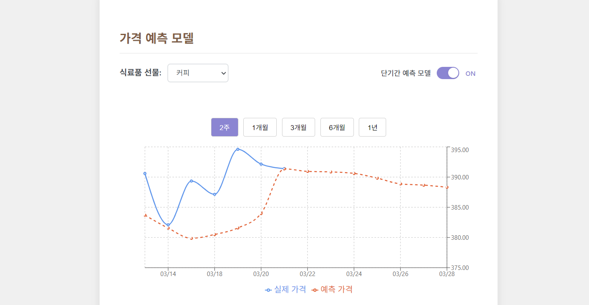
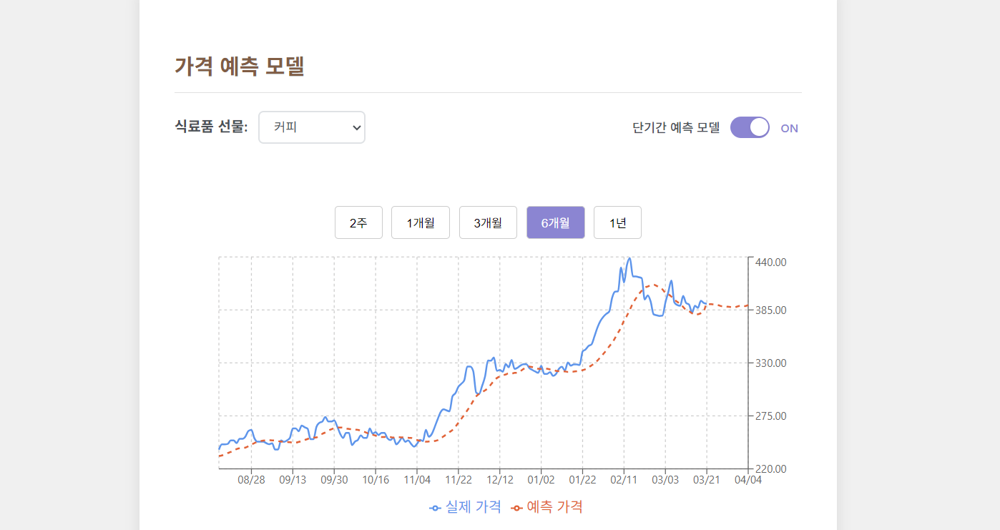
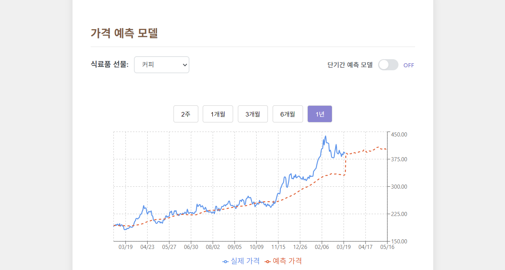

# 2025.05.27-진행 현황

## LSTM-Entmax 커피 가격 예측 모델

이 모델은 **LSTM(Long Short-Term Memory)** 기반의 시계열 예측 모델에 **Entmax 어텐션** 메커니즘을 결합하여 커피 가격을 예측한다.

### 핵심 구성 요소

-   **LSTM**: 시계열 데이터의 장기 의존성을 효과적으로 학습하는 순환 신경망(RNN) 구조
-   **Entmax 어텐션**: 소프트맥스(softmax) 대신 **Entmax**(특히 Entmax15)를 사용한 어텐션 메커니즘으로, 희소(sparse)한 어텐션 분포를 만들어 해석력과 성능을 높임
-   **정적 피처 결합**: 시계열 입력 외에도 경제/기후 등 정적 피처를 함께 입력받아 예측 성능을 향상
-   **커스텀 손실 함수**: 방향성 손실, 분산 손실 등 시계열 예측에 특화된 손실 함수를 추가로 사용

### 입력 데이터 구성

-   **시계열 피처**: 100일 × N개 피처 (가격, 수익률, 변동성, 모멘텀, 볼린저 밴드 등)
-   **정적 피처**: 9개 기후 관련 피처 (온도, 강수량, 수확기 정보 등)
-   **타겟**: 커피 가격 수익률 (Coffee_Price_Return)

## 모델 예측 과정

### 1. 데이터 분할

전체 데이터셋을 80%는 학습용, 20%는 테스트용으로 나눈다.

### 2. 테스트 기간 예측 (`predict_and_inverse`)

이 함수는 **슬라이딩 윈도우 방식**으로 테스트 데이터에서 100일 구간을 기준으로 모델이 향후 14일간의 커피 가격 수익률을 예측하고, 이를 실제 가격으로 복원한다.

#### 동작 방식:

-   100일 윈도우를 1일씩 이동하면서 각 시점에서 14일 예측
-   예: `[Day 1-100] (실제 데이터) → Day 101-114 예측 / [Day 2-101] (실제 데이터) → Day 102-115 예측 / [Day 3-102] (실제 데이터) → Day 103-116 예측`
-   겹치는 날짜들의 여러 예측값을 평균하여 안정된 예측 시계열 생성

#### 예시:

2023년 5월 10일이 마지막 입력일이라면, 해당 시점의 실제 가격(예: 190.0)을 기준으로 수익률 예측값을 곱해 2023년 5월 11일부터 24일까지의 가격을 계산한다.

### 3. 미래 14일 예측 (`predict_future`)

이 함수는 테스트 데이터의 마지막 100일간 시계열 데이터를 기반으로, 향후 14일간의 커피 수익률을 **한 번에** 예측한다.

#### 동작 방식:

-   `data_window = 100`, `future_target = 14`
-   마지막 100일 데이터를 입력으로 사용
-   모델이 한 번의 예측으로 14일치 수익률 출력
-   마지막 실제 가격을 기준으로 예측 수익률을 누적 곱하여 실제 가격 계산

#### 예시:

-   `test_df`의 마지막 날짜가 2023-04-09라고 가정
-   2023-01-01 ~ 2023-04-09 중 마지막 100일 데이터를 입력으로 사용
-   모델은 2023-04-10 ~ 2023-04-23의 수익률을 출력
-   마지막 실제 가격(예: 192.0)을 기준으로 예측 수익률을 누적 곱하여 14일 예측 가격 계산

## 모델 성능 평가

### 정량적 지표

-   **RMSE** (Root Mean Square Error): 예측 오차의 크기
-   **MAE** (Mean Absolute Error): 절대 오차의 평균

### 정성적 평가

-   실제 vs 예측 시각화
-   방향성 정확도 (상승/하락 예측 정확도)
-   변동성 반영 정도

## 기술적 세부사항

### 손실 함수 구성

```
총 손실 = MSE + α×방향성 손실 + β×분산 손실
(α=0.2, β=0.1)
```

-   단순 가격 정확도뿐 아니라 방향성과 변동성도 고려

### 데이터 전처리

-   StandardScaler로 정규화 (타겟 변수 제외)
-   결측값 forward/backward fill
-   시계열 특성 유지하며 학습/테스트 분할

## 모델 확장 및 실무 활용

실시간 데이터 수집이 가능하다면:

1. **성능 검증**: 오늘 기준 1년 전부터를 test set으로 설정하여 `predict_and_inverse`를 통해 예측 성능을 검증
2. **실시간 예측**: 오늘 기준 14일 뒤의 커피 가격 흐름을 `predict_future`를 통해 예측
3. **투자 활용**: 실제 시계열 예측 및 투자 판단에 활용 가능

## 주요 파일 설명

-   **models.py**  
    LSTM + Entmax 어텐션 + 정적 피처 결합 모델 정의

    -   `EntmaxAttention`: Entmax 기반 어텐션 레이어
    -   `AttentionLSTMModel`: 전체 모델 구조 (LSTM, 어텐션, 게이트, 정적 피처 결합)

-   **losses.py**  
    커스텀 손실 함수

    -   `directional_loss`: 예측값과 실제값의 변화 방향 일치 여부
    -   `variance_loss`: 예측값과 실제값의 분산 차이

-   **trainer.py**  
    모델 학습, 예측, 평가 함수

    -   `train_model`: 복합 손실로 학습
    -   `predict_and_inverse`, `predict_future`: 예측 및 역정규화
    -   `evaluate_and_save`: 결과 평가 및 저장

-   **data_loader.py**  
    경제/기후 데이터 로딩 및 예측 결과 저장 함수

-   **preprocessor.py**  
    데이터 전처리 및 피처 생성, 정규화, 분할 함수

-   **dataset.py**  
    PyTorch용 시계열+정적 피처 데이터셋 클래스

-   **coffee_price_fetcher.py**  
    yfinance를 이용한 커피 선물 가격 수집, 예측 결과에 실제 가격 추가

-   **visualizer.py**  
    학습 곡선, 예측 결과 등 시각화 함수

-   **utils.py**  
    장치 선택, 어텐션 엔트로피 계산 등 보조 함수

-   **run_model.py**  
    전체 파이프라인 실행 메인 파일 (명령행 인자 기반 실행)

-   **init.py**  
    패키지 초기화 및 주요 함수/클래스 export

---

## 모델 개발 현황



모델의 단기 예측 결과는 실제 커피 가격의 변동 패턴을 정밀하게 예측하지는 못하지만 전체적인 흐름을 잘 따라가는 것으로 나타난다.



테스트셋 중 6개월 구간에 대한 분석 결과, 모델은 전반적인 가격 추세를 적절히 반영하나 극단적 가격 변동에 대해서는 지연된 반응을 보인다. 모델의 예측 메커니즘은 급격한 상승 및 하락 국면을 실시간으로 감지하기보다는, 약 2주 정도의 시차를 두고 해당 변동성을 반영하는 경향을 나타낸다. 이러한 현상은 모델이 급변하는 시장 충격을 사후적으로 학습하여 예측에 반영하는 특성을 보여준다.

특히 주목할 점은 모델이 구조적 트렌드 변화는 비교적 정확히 예측하는 반면, 단발적이고 급격한 시장 이벤트에 대해서는 반응성이 제한적이라는 것이다. 이는 LSTM 기반 시계열 모델의 일반적 특성으로, 과거 패턴에 기반한 예측 방식이 예측 불가능한 외부 충격에 대해서는 상대적으로 보수적 반응을 보이는 것으로 해석된다.

> 모델이 2주가 아닌 장기(8주 이상) 예측이 가능한지 확인하기 위해 현재 모델에서 예측 기간을 14일에서 56일로 늘려서 추가 실험을 진행하였다.



기존 모델처럼 80%를 학습 데이터로 활용, 20%를 테스트로 활용하였다. 그 후 테스트셋 이후 56일을 예측한다. 흐름은 따라가지만 역시 급격한 변화를 늦게 감지하는 경향을 보인다.
