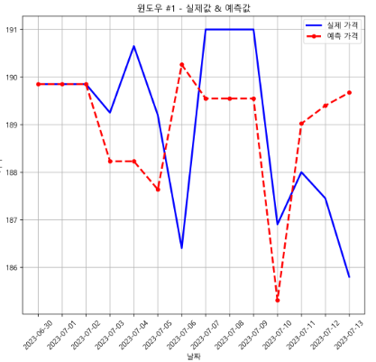

# 제목

## 1. 프로젝트 개요/목적

본 프로젝트는 커피 재배 지역의 기후 데이터, 거시 경제 지표, 뉴스 기사 데이터를 복합적으로 분석하여 단기(2주) 및 중기(최대 4주) 커피 선물(Coffee C) 가격을 예측하는 시스템이다.

최근 기후변화와 경제적 불확실성으로 인한 커피 시장의 가격 변동성 증가 문제에 대응하고자 한다. 주요 목적은 원두 구매 업체들이 최적의 구매 시점을 파악하여 비용 효율성을 높일 수 있도록 지원하는 것이다.

궁극적으로 이 프로젝트는 공급망 내 가격 충격을 완화하여 소비자에게 전가되는 커피 가격 인상을 방어하는 데 기여할 것으로 예상되어 진행하게 되었다.

## 2. 현재 구현 상황 및 제약 조건

본 프로젝트의 최종 목표는 실시간 데이터를 수집하여 당일 기준 미래 가격을 예측하는 시스템 구축이다. 그러나 개발 과정에서 몇 가지 데이터 접근성 문제가 확인되었다. 일부 데이터는 유료 서비스로만 제공되며, 특히 거시 경제 지표는 실시간 수집에 상당한 제약이 있었다.

이러한 한계를 고려하여 현재는 이미 확보된 데이터를 기반으로 학습 및 테스트 데이터셋을 구성하였다. 아울러 추후 실시간 데이터 수집이 가능해지는 상황에 대비하여 모델 아키텍처를 유연하게 설계하였다. 따라서 현 단계에서는 모든 계획된 데이터를 활용하지는 않고, 뉴스 기사 데이터, 기후 데이터와 함께 경제 지표 중에서는 환율 및 유가 정보만을 선별적으로 모델에 반영하였다.

모델은 기후·경제 데이터 기반 모델과 뉴스 기사 데이터 기반 모델로 총 두 가지를 독립적으로 개발하였다. 최종 예측 결과는 이 두 모델의 출력값을 통합하는 방식으로 구현하였다. 각 모델의 세부적인 개발 과정과 통합 기준에 관한 상세 내용은 6장에서 다루도록 한다.

## 3. 기후·경제 데이터 기반 모델

### 3.1 사용된 데이터와 모델은?

기후·경제 데이터 기반 모델은 커피 생두 가격의 시계열적 특성과 기후 요인, 경제적 요인 간의 복합적 관계를 파악하기 위해 개발되었다. 주요 사용 데이터는 다음과 같이 구성되었다.

**기후 데이터**:

-   `PRECTOTCORR`: 브라질, 콜롬비아, 에티오피아 등 주요 커피 생산 지역의 보정된 강수량 데이터
-   `season_tag`: 각 생산지의 수확 시즌 정보(수확기, 수확 전, 비수확기)
-   `days_until_harvest`: 각 생산지의 수확까지 남은 일수

**경제 지표**:

-   `Crude_Oil_Price`: 국제 유가
-   `USD_BRL`: 주요 생산국(브라질) 통화와 미국 달러 간 환율

**파생 변수**:

-   절대 수익률(`Abs_Return`)
-   n일 변동성(`Volatility_5d`, `Volatility_10d`, `Volatility_20d`)
-   모멘텀(`Momentum_5d`, `Momentum_10d`, `Momentum_20d`)
-   볼린저 밴드 너비(`BB_Width_20d`)
-   Z-점수(`Z_Score_20d`: 현재 가격이 과거 n일 평균에서 얼마나 떨어져 있는지)

모델은 LSTM(Long Short-Term Memory)과 Attention 메커니즘을 결합한 심층 신경망 구조를 채택하였다. 이는 인코더-디코더 방식이 아닌, 시퀀스 입력 후 단일 예측 출력을 생성하는 방식으로 설계되었다. 구체적으로는 50일 시퀀스를 입력으로 받아 향후 14일의 가격을 예측하는 구조이다.

### 3.2 Why LSTM + Attention?

LSTM과 Attention 메커니즘을 결합한 모델을 선택한 근거는 다음과 같다.

**LSTM 선택 이유**:

1. 장기 의존성 포착: 커피 가격은 수개월에 걸친 장기적 패턴을 보이며, LSTM은 이러한 장기 의존성을 효과적으로 포착할 수 있다.
2. 비선형성 모델링: 커피 가격 변동은 다양한 요인의 복합적 상호작용에서 발생하는 비선형적 특성을 가지며, LSTM은 이러한 복잡한 패턴을 학습할 수 있다.
3. 시퀀스 데이터 처리: 기후 변화의 누적 효과와 경제 지표의 연속적 변화를 시계열 맥락에서 처리하는 데 적합하다.

**Attention 메커니즘 도입 이유**:

1. 선택적 집중: Attention은 예측에 가장 중요한 시점(날짜)에 가중치를 부여하여 모델의 해석 가능성을 높였다.
2. 시계열 데이터의 불규칙성 처리: 커피 가격에 영향을 미치는 요인들은 일정하지 않고, 특정 시점에 더 큰 영향을 미칠 수 있다.
3. 정보 손실 방지: 50일의 긴 시퀀스에서 발생할 수 있는 정보 손실을 방지하고, 중요한 과거 패턴을 선별적으로 활용할 수 있다.

모델 구현 시에는 Softmax Attention을 적용하여 가중치의 합이 1이 되도록 정규화하였으며, 이는 각 시점의 상대적 중요도를 명확히 표현한다. 또한 손실 함수로는 MSE(Mean Squared Error)와 Huber Loss를 선택적으로 사용할 수 있게 하여, 극단적 가격 변동에 대한 견고성을 확보하였다.

슬라이딩 윈도우 방식의 예측 구현과 온라인 학습 옵션을 통해 모델이 새로운 데이터에 점진적으로 적응할 수 있도록 하였으며, 실제 시장 휴장일을 고려한 예측값 보정 로직도 구현하여 현실적인 예측 시스템을 구축하였다.

## 4. 결과: 기후·경제 데이터 기반 모델

> 모델 학습 시에 epoch을 50으로 두었지만, 5 이후부터 크게 진동하여, epoch은 5로 고정하였다 모델은 온라인 학습을 진행하지 않고, **기본 LSTM + Attention 모델**을 활용하였으며, 손실함수로는 **Huber Loss( delta = 1.0 )** 를 선택하였다. 추가로 슬라이딩 윈도우 방식을 적용했을 때 **Stride는 7일**로 설정하였다.

모델 예측은 기본적으로 두 가지 접근 방식을 활용하였다. 첫째는 기본 LSTM을 이용하여 테스트 세트 전체에 대한 예측을 수행하는 방식이고, 둘째는 50일 데이터를 기반으로 향후 14일을 예측하는 슬라이딩 윈도우 방식이다. 테스트 세트 전체에 대한 예측 결과는 아래 이미지와 같다.

모델은 전반적인 가격 흐름과 중장기적 추세를 적절히 포착하고 있으나, 급격한 변동성에 대한 대응 능력은 제한적이다. 예측 기간이 길어질수록 정확도가 저하되는 현상이 나타나지만, 본 프로젝트의 주요 목표가 단기(최대 4주) 예측에 있으므로 이는 허용 가능한 수준이다.

특히 주목할 점은 2024년 11월 중순 이후 발생한 급격한 상승 국면에서의 모델 성능이다. 이 구간에서 모델은 상승 추세 자체는 정확히 식별하였으나, 실제 상승폭의 규모를 상당히 과소평가하는 한계를 보인다. 이는 극단적 시장 변동 상황에서 모델 예측력이 현저히 저하됨을 명확히 보여주는 결과이다.

이러한 특성은 기후 변화나 지정학적 이슈와 같은 예측 불가능한 외부 충격으로 인한 급격한 가격 변동 패턴이 학습 데이터에 충분히 반영되지 못했기 때문으로 판단된다. 급격한 가격 변동 사례가 상대적으로 희소하여 모델이 이러한 극단적 상황을 일반화하기 어려운 것이 주된 원인으로 분석된다.

> 예측 첫 2주
> 

또한 단기적인 측면으로 봤을 때는 흐름을 전혀 따라가지 못하고, 변동성 또한 잡지 못하는 모습을 보인다.

다음으로 두 번째 예측은 슬라이딩 윈도우 방식을 적용한 예측 방법이다.

슬라이딩 윈도우 방식을 적용한 결과, 예측 성능이 현저히 개선된 것을 확인할 수 있다. 이 방법은 50일 데이터를 기반으로 향후 14일을 예측하고, 7일 단위로 윈도우를 이동시키며 연속적인 예측을 수행하는 방식이다.

기존의 일괄 예측 방법과 비교하여, 슬라이딩 윈도우 접근법은 단기 가격 변동 추세를 더욱 정확하게 포착하고, 실시간 시장 상황에 더 민감하게 반응하는 특성을 보인다. 특히 단기 예측 구간에서는 그 성능 차이가 뚜렷하게 나타나며, 이는 본 프로젝트의 주요 목표인 2~4주 예측에 더 적합한 방법론임을 입증하는 결과이다.

## 5. 슬라이딩 윈도우 방식의 한계점

슬라이딩 윈도우 방식은 앞서 설명한 장점에도 불구하고 몇 가지 주목할 만한 한계점이 존재한다. 가장 두드러진 문제점은 인접한 윈도우 간 예측 패턴의 과도한 유사성이다. 아래 이미지에서 확인할 수 있듯이, 연속된 윈도우에서 예측된 가격 흐름이 거의 동일한 형태를 보인다.

이러한 현상이 발생하는 근본적 원인은 연속된 윈도우 간 학습 데이터의 높은 중복도에 있다. 예컨대, 1~50일 데이터로 51~64일을 예측하는 첫 번째 윈도우와 8~57일 데이터로 58~71일을 예측하는 두 번째 윈도우 간에는 약 86%(8~50일)의 학습 데이터가 중복된다. 이로 인해 모델이 생성하는 패턴이 거의 동일한 형태로 반복되는 현상이 발생하며, 이는 예측의 다양성과 적응성을 저하시키는 요인이 된다.

본 프로젝트의 핵심 목표가 2~4주 예측에 있음을 고려하여, 이러한 한계를 극복하기 위한 개선 방안을 도출하였다. 구체적으로, 4주 예측 시나리오에서는 예측 윈도우 크기를 14일에서 28일로 확장하고, 학습 기간을 50일에서 60일로 증가시키는 방안이 효과적이다. 이러한 조정을 통해 4주 예측 결과에서 2주 주기의 반복적 패턴이 나타나는 현상을 완화할 수 있으며, 예측의 독립성과 정확도를 향상시킬 수 있다.

이러한 접근법의 개선에도 불구하고, 모델은 여전히 위 이미지에서 알 수 있듯이 장기적 관점에서의 급격한 가격 변동을 효과적으로 포착하지 못하는 근본적 한계를 지닌다.

2025년 하반기에 나타난 가파른 상승 국면에서 모델의 예측값은 실제 시장 움직임과 상당한 괴리를 보인다. 실제 가격이 급격한 상승세를 보이는 반면, 예측 가격은 완만한 증가 추세만을 나타내어 모델이 시장의 극단적 변동성을 과소평가하는 경향이 뚜렷하다.

이는 본 모델이 점진적인 가격 변화에는 적절히 대응할 수 있으나, 외부 충격이나 시장 구조의 급격한 변화에 따른 극단적 가격 움직임을 예측하는 데에는 여전히 한계가 있음을 시사하는 결과이다.

## 6. 급상승 문제 해결과 뉴스 기사 모델 통합

기후·경제 데이터 기반 모델의 주요 한계점은 점진적인 추세 변화에는 적절히 대응하나, 급격한 시장 변동이나 외부 충격에 따른 구조적 변화를 예측하는 데 제약을 보인다는 점이다.

이러한 한계를 극복하기 위한 방법으로 최근 일정 기간(예: 2-3주) 동안의 가격 변화율이 임계치를 초과할 경우, 후속 예측에 가중치를 부여하여 급변하는 시장 상황에 대응하는 동적 보정 메커니즘을 고려해 볼 수 있다. 이는 모델이 급격한 변동성에 점진적으로 적응할 수 있게 하는 접근법이다.

그러나 이러한 사후 보정 방식은 근본적 한계를 내포한다. 급격한 가격 변동의 지속 기간을 사전에 예측하기 어렵기 때문에, 일시적인 급등(급락) 이후 정상화 단계에서 불필요한 보정이 적용될 위험이 존재한다. 다시 말해, 가격 보정을 적용하는 시점에 이미 급변동 국면이 종료되어 오히려 예측 오차가 증가할 가능성이 크다. 따라서 사후적 보정보다는 급격한 시장 변동의 발생 시점과 지속 기간을 사전에 예측하는 능력이 보다 중요하다.

이러한 한계를 극복하기 위해 뉴스 기사 감성 분석 모델을 기후·경제 데이터 기반 모델과 통합하는 앙상블 접근법을 활용한다. 뉴스 기사는 시장 충격을 유발하는 사건들을 실시간으로 반영하므로, 급격한 가격 변동의 전조를 포착하는 데 매우 유용할 것으로 예측된다. 구체적으로, 뉴스 감성 분석 모델이 특정 임계값 이상의 강한 상승(또는 하락) 시그널을 감지할 경우, 기본 모델의 예측값에 차등적 가중치를 부여하는 방식이다.

예를 들어, 브라질의 가뭄이나 서리 피해와 같은 수급 충격 관련 뉴스가 집중적으로 보도될 경우, 뉴스 모델은 높은 상승 확률 점수(예: 0.85)를 출력한다. 이때 기본 모델이 예측한 가격이 230\$라면, 뉴스 모델의 신호 강도에 비례하여 10~30% 상향 조정된 253~299\$ 사이의 최종 예측값을 제시하는 것이다. 반대로, 풍작 전망이나 수요 감소 뉴스가 주를 이룰 경우에는 하향 조정이 이루어진다. 이러한 방식은 기본 모델이 포착하지 못하는 외부 충격 요인들을 사전에 감지하여 예측의 정확도를 높일 것으로 보인다.
